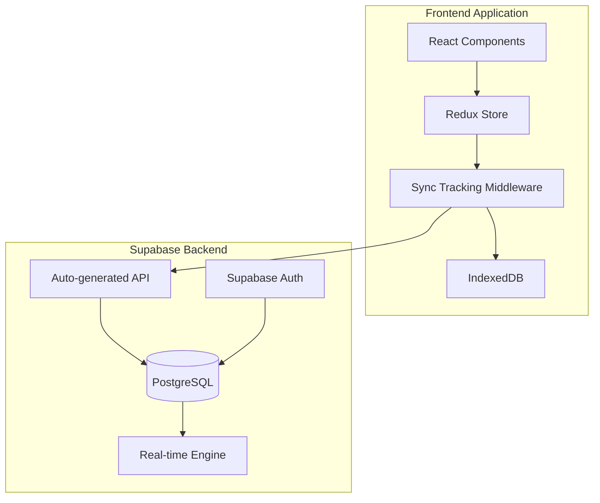

# Backend Sync Strategy - **IMPLEMENTED APPROACH**

## Overview

This document outlines the **implemented** backend synchronization strategy for the packing list app. The application uses **Supabase as the backend** with a **middleware-based sync system** that maintains offline-first functionality.

## ✅ Current Implementation

### Chosen Solution: Supabase + Middleware-based Sync

After evaluation, we implemented a **Supabase-powered sync system** with the following characteristics:

- **Backend**: Supabase (PostgreSQL + real-time subscriptions)
- **Client**: Redux middleware + IndexedDB storage
- **Sync Protocol**: Direct Supabase client calls with middleware-based change tracking
- **Conflict Resolution**: Smart auto-resolution with manual fallback

#### Why This Approach Won

1. **🎯 Rapid Development**: Supabase provides auth, database, and real-time out of the box
2. **🛠️ Simplicity**: No custom backend to maintain
3. **⚡ Performance**: Direct database connections with built-in caching
4. **🔒 Security**: Row-level security and built-in authentication
5. **💰 Cost-effective**: Generous free tier with automatic scaling

## Architecture Overview



## Current Data Flow

### 1. Change Tracking (Middleware-Based)

All data changes are captured by Redux middleware using state diffing:

```typescript
export const syncTrackingMiddleware: Middleware =
  (store) => (next) => (action) => {
    const prevState = store.getState();
    const result = next(action); // Process action first
    const nextState = store.getState();

    // Detect changes via state diffing
    if (hasRelevantChanges(prevState, nextState, action)) {
      // Persist to IndexedDB immediately
      persistChange(change);

      // Attempt to sync to Supabase if online
      if (isOnline && !isLocalUser(userId)) {
        pushChangeToServer(change);
      }
    }

    return result;
  };
```

### 2. Server Synchronization

#### Push to Server (Immediate)

```typescript
async function pushChangeToServer(change: Change): Promise<void> {
  try {
    switch (change.entityType) {
      case 'trip':
        await supabase.from('trips').upsert(transformTripData(change.data));
        break;
      case 'person':
        await supabase
          .from('trip_people')
          .upsert(transformPersonData(change.data));
        break;
      // ... other entity types
    }

    // Mark as synced in IndexedDB
    await markChangeSynced(change.id);
  } catch (error) {
    console.error('Sync failed, change remains queued:', error);
  }
}
```

#### Pull from Server (On Auth/Periodic)

```typescript
export const syncFromServer = createAsyncThunk(
  'sync/syncFromServer',
  async ({ userId, since }, { dispatch }) => {
    // Pull all entity types in parallel
    const [trips, people, items, rules] = await Promise.all([
      pullTripsFromServer({ userId, since }),
      pullPeopleFromServer({ userId, since }),
      pullItemsFromServer({ userId, since }),
      pullRulesFromServer({ userId, since }),
    ]);

    // Process conflicts and update Redux state
    return { trips, people, items, rules };
  }
);
```

### 3. Conflict Resolution Strategy

#### Smart Auto-Resolution

The system automatically resolves timestamp-only conflicts:

```typescript
function resolveTimestampOnlyConflict<T>(local: T, server: T): T | null {
  // Exclude timestamp fields from comparison
  const excludeFields = ['updatedAt', 'createdAt', 'timestamp', 'version'];

  // If only timestamps differ, auto-resolve with server timestamp
  if (deepEqual(filterFields(local), filterFields(server))) {
    console.log('✅ Auto-resolving timestamp-only conflict');
    return server;
  }

  // Real conflict requires manual resolution
  console.log('❌ Data conflict detected - manual resolution required');
  return null;
}
```

#### Manual Conflict Resolution

For real data conflicts, the system:

1. Stores conflict details in Redux state
2. Shows conflict UI to the user
3. Allows user to choose local/server/manual resolution
4. Applies resolution and continues sync

## Database Schema (Supabase)

### Core Tables

```sql
-- Trips table
CREATE TABLE trips (
    id TEXT PRIMARY KEY,
    user_id TEXT NOT NULL REFERENCES auth.users(id),
    title TEXT NOT NULL,
    description TEXT,
    days JSONB DEFAULT '[]',
    trip_events JSONB DEFAULT '[]',
    settings JSONB DEFAULT '{}',
    created_at TIMESTAMPTZ DEFAULT NOW(),
    updated_at TIMESTAMPTZ DEFAULT NOW(),
    version INTEGER DEFAULT 1,
    is_deleted BOOLEAN DEFAULT FALSE
);

-- People table
CREATE TABLE trip_people (
    id TEXT PRIMARY KEY,
    trip_id TEXT NOT NULL REFERENCES trips(id) ON DELETE CASCADE,
    name TEXT NOT NULL,
    age INTEGER,
    gender TEXT,
    settings JSONB DEFAULT '{}',
    created_at TIMESTAMPTZ DEFAULT NOW(),
    updated_at TIMESTAMPTZ DEFAULT NOW(),
    version INTEGER DEFAULT 1,
    is_deleted BOOLEAN DEFAULT FALSE
);

-- Items table
CREATE TABLE trip_items (
    id TEXT PRIMARY KEY,
    trip_id TEXT NOT NULL REFERENCES trips(id) ON DELETE CASCADE,
    name TEXT NOT NULL,
    category TEXT,
    quantity INTEGER DEFAULT 1,
    notes TEXT,
    person_id TEXT REFERENCES trip_people(id),
    day_index INTEGER,
    rule_id TEXT,
    rule_hash TEXT,
    packed BOOLEAN DEFAULT FALSE,
    created_at TIMESTAMPTZ DEFAULT NOW(),
    updated_at TIMESTAMPTZ DEFAULT NOW(),
    version INTEGER DEFAULT 1,
    is_deleted BOOLEAN DEFAULT FALSE
);

-- Default item rules table
CREATE TABLE default_item_rules (
    id TEXT PRIMARY KEY,
    user_id TEXT NOT NULL REFERENCES auth.users(id),
    name TEXT NOT NULL,
    calculation JSONB NOT NULL,
    conditions JSONB DEFAULT '[]',
    metadata JSONB DEFAULT '{}',
    created_at TIMESTAMPTZ DEFAULT NOW(),
    updated_at TIMESTAMPTZ DEFAULT NOW(),
    version INTEGER DEFAULT 1,
    is_deleted BOOLEAN DEFAULT FALSE
);

-- Trip rules association table
CREATE TABLE trip_default_item_rules (
    id TEXT PRIMARY KEY,
    trip_id TEXT NOT NULL REFERENCES trips(id) ON DELETE CASCADE,
    rule_id TEXT NOT NULL REFERENCES default_item_rules(id) ON DELETE CASCADE,
    user_id TEXT NOT NULL REFERENCES auth.users(id),
    created_at TIMESTAMPTZ DEFAULT NOW(),
    updated_at TIMESTAMPTZ DEFAULT NOW(),
    version INTEGER DEFAULT 1,
    is_deleted BOOLEAN DEFAULT FALSE,
    UNIQUE(trip_id, rule_id)
);
```

### Row Level Security (RLS)

```sql
-- Users can only access their own data
ALTER TABLE trips ENABLE ROW LEVEL SECURITY;
CREATE POLICY "Users can access own trips" ON trips
    FOR ALL USING (auth.uid()::text = user_id);

ALTER TABLE trip_people ENABLE ROW LEVEL SECURITY;
CREATE POLICY "Users can access people in their trips" ON trip_people
    FOR ALL USING (trip_id IN (SELECT id FROM trips WHERE user_id = auth.uid()::text));

-- Similar policies for other tables...
```

## Offline-First Features

### 1. IndexedDB Persistence

All data is immediately persisted to IndexedDB:

```typescript
// Every entity change is saved locally first
await TripStorage.saveTrip(tripData);
await PersonStorage.savePerson(personData);
await ItemStorage.saveItem(itemData);

// Changes are tracked for sync
await trackChange({
  entityType: 'trip',
  entityId: tripData.id,
  operation: 'update',
  data: tripData,
  synced: false,
});
```

### 2. Offline Hydration

When users sign in, data is loaded from IndexedDB first:

```typescript
async function reloadFromIndexedDB(dispatch: Function, userId: string) {
  // Load user data from IndexedDB
  const offlineState = await loadOfflineState(userId);

  // Hydrate Redux state (preserving demo data)
  dispatch({
    type: 'HYDRATE_OFFLINE',
    payload: offlineState,
  });

  // Start sync service for non-local users
  if (!isLocalUser(userId)) {
    await startSyncService(dispatch, userId);
  }
}
```

### 3. Demo Data Preservation

Demo trips are preserved during auth changes and IndexedDB reloads:

```typescript
export const hydrateOfflineHandler = (state, action) => {
  // Preserve demo trips from current state
  const currentDemoTrips = Object.entries(state.trips.byId).filter(([tripId]) =>
    isDemoTripId(tripId)
  );

  const hydratedState = { ...state, ...action.payload };

  // Merge demo trips back into hydrated state
  if (currentDemoTrips.length > 0) {
    hydratedState.trips.byId = {
      ...hydratedState.trips.byId,
      ...Object.fromEntries(currentDemoTrips),
    };
  }

  return hydratedState;
};
```

## Local vs Remote Users

The system supports both local-only users and synchronized users:

```typescript
function isLocalUser(userId: string): boolean {
  return (
    userId === 'local-user' ||
    userId.startsWith('local-') ||
    userId === 'shared@local.device'
  );
}

// Local users: Data stays in IndexedDB only
// Remote users: Data syncs to Supabase
```

## Testing Strategy

### Current Test Coverage

1. **Unit Tests**: Middleware change detection, conflict resolution
2. **Integration Tests**: Sync flows, offline hydration
3. **E2E Tests**: User workflows with demo data preservation

### Key Test Scenarios

- ✅ Offline operations work without network
- ✅ Demo data preserved during auth changes
- ✅ Conflicts auto-resolve when only timestamps differ
- ✅ Manual conflict resolution for data conflicts
- ✅ Local users stay offline-only
- ✅ Remote users sync to Supabase

## Performance Characteristics

### Sync Performance

- **Change Detection**: O(1) via middleware interception
- **Persistence**: Immediate to IndexedDB
- **Network Sync**: Async, non-blocking
- **Conflict Resolution**: Smart auto-resolution reduces manual work

### Network Efficiency

- **Push**: Individual changes sent immediately when online
- **Pull**: Incremental sync with `since` timestamp
- **Batching**: Multiple entity types pulled in parallel

## Trade-offs Made

### ✅ Benefits of Current Approach

- **Simple Architecture**: Fewer moving parts than original complex design
- **Reliable Offline**: IndexedDB-first ensures data never lost
- **Fast Development**: Supabase eliminates backend maintenance
- **Auto-scaling**: Supabase handles scaling and performance
- **Real-time Ready**: Built-in real-time subscriptions available

### ⚠️ Trade-offs Accepted

- **Supabase Dependency**: Vendor lock-in vs self-hosted backend
- **Less Complex Queueing**: Immediate sync vs sophisticated retry logic
- **Tighter Coupling**: Middleware approach couples sync with Redux
- **No Background Sync**: Sync on user actions vs background processing

## Future Enhancements

### Short-term (Next 3-6 months)

1. **Real-time Sync**: Implement Supabase real-time subscriptions
2. **Conflict UI**: Better user interface for manual conflict resolution
3. **Sync Metrics**: Add monitoring and performance metrics
4. **Background Sync**: Service worker for background processing

### Long-term (6+ months)

1. **Collaboration**: Multi-user trip collaboration features
2. **Optimistic UI**: More sophisticated optimistic updates
3. **Data Migration**: Tools for moving between local/remote modes
4. **Advanced Conflict Resolution**: AI-powered conflict suggestions

## Migration Notes

This implementation represents a significant evolution from the original plans:

- **❌ Abandoned**: Complex service layer with queues and orchestration
- **❌ Abandoned**: Custom backend development and maintenance
- **✅ Adopted**: Supabase as backend-as-a-service
- **✅ Adopted**: Middleware-based change tracking
- **✅ Adopted**: Smart conflict resolution with auto-resolution
- **✅ Adopted**: Demo data preservation for better UX

The current approach balances simplicity, reliability, and performance while maintaining the core offline-first principles.
