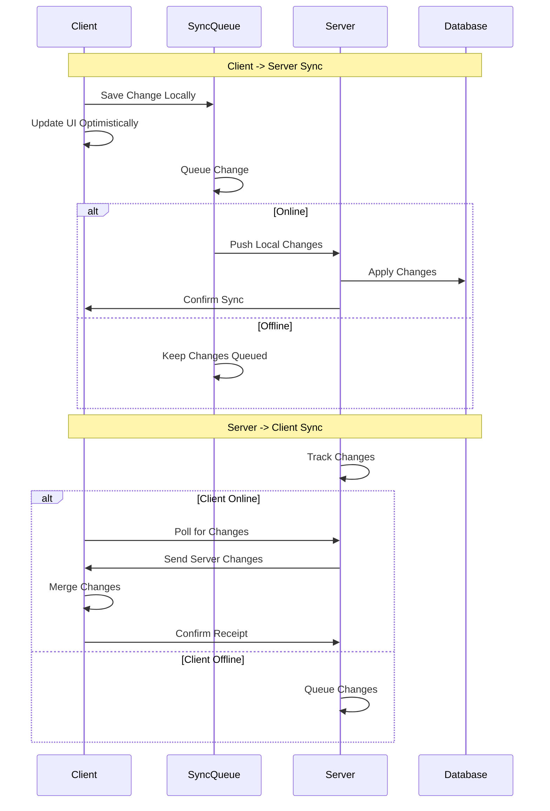

# Backend Sync Strategy

## Overview

This document outlines the strategy for adding backend synchronization capabilities to the packing list app while maintaining its offline-first functionality.

## Core Requirements

- Maintain offline-first functionality - app must work without internet
- Sync data when connection is available
- Handle conflict resolution
- Secure data transmission and storage
- Support multiple devices per user

## Proposed Approaches

### 1. Event Sourcing with CouchDB/PouchDB

#### Architecture

- **Backend**: Node.js + CouchDB
- **Client**: Current app + PouchDB
- **Sync Protocol**: CouchDB's built-in replication protocol

#### Pros

- Built-in offline support
- Automatic conflict resolution
- Real-time sync capabilities
- Mature and battle-tested solution
- Event history and audit trail built-in

#### Cons

- Learning curve for CouchDB
- May be overkill for simple data structures
- Less flexibility in data modeling

### 2. Custom Sync with Timestamp-based Resolution

#### Architecture

- **Backend**: Node.js + PostgreSQL
- **Client**: Current app + IndexedDB
- **Sync Protocol**: Custom REST API with timestamp-based versioning

#### Components

- Sync queue in IndexedDB
- Last sync timestamp tracking
- Periodic sync attempts when online
- Conflict resolution based on timestamps and version vectors

#### Pros

- Full control over sync logic
- Simpler stack (standard REST API)
- More flexible data modeling
- Easier to understand and maintain

#### Cons

- Need to implement conflict resolution
- More complex to handle real-time updates
- Higher risk of edge cases

### 3. GraphQL Subscriptions with Optimistic Updates

#### Architecture

- **Backend**: Node.js + Apollo Server + PostgreSQL
- **Client**: Apollo Client + IndexedDB
- **Sync Protocol**: GraphQL Queries/Mutations + Subscriptions

#### Components

- Offline mutation queue
- Optimistic updates in UI
- Real-time subscriptions when online
- Conflict resolution through version control

#### Pros

- Strong typing and schema
- Real-time capabilities
- Good developer experience
- Rich ecosystem

#### Cons

- More complex setup
- Higher initial learning curve
- Potentially larger bundle size

## Recommended Approach: Custom Sync with Timestamp-based Resolution

For our specific use case, I recommend going with approach #2 for the following reasons:

1. **Simplicity**: The data model is relatively straightforward and doesn't require complex conflict resolution
2. **Control**: We can fine-tune the sync behavior to our specific needs
3. **Familiarity**: Standard REST API is more familiar to most developers
4. **Scalability**: Easier to modify and extend as requirements change

### Implementation Plan

1. **Phase 1: Backend Setup**

   - Set up Node.js + Express backend
   - Implement PostgreSQL schema
   - Create basic CRUD API endpoints
   - Add authentication/authorization

2. **Phase 2: Sync Infrastructure**

   - Implement sync queue in IndexedDB
   - Add timestamp tracking
   - Create sync service worker
   - Implement basic conflict resolution

3. **Phase 3: Client Integration**

   - Modify state management to support sync
   - Add online/offline detection
   - Implement optimistic updates
   - Add sync status indicators

4. **Phase 4: Testing & Refinement**
   - Add sync-specific tests
   - Test various offline scenarios
   - Performance optimization
   - Edge case handling

### Data Flow



### Bi-directional Sync Strategy

#### Server-side Change Tracking

1. **Change Log Table**

```sql
CREATE TABLE change_log (
    id SERIAL PRIMARY KEY,
    entity_type TEXT NOT NULL,
    entity_id TEXT NOT NULL,
    operation TEXT NOT NULL,
    timestamp TIMESTAMPTZ NOT NULL,
    data JSONB NOT NULL,
    version INTEGER NOT NULL,
    device_id TEXT NOT NULL,
    user_id TEXT NOT NULL
);
```

2. **Change Detection**

- Database triggers to capture changes
- Version increment on each change
- Track originating device to prevent loops

#### Client-side Updates

1. **Pull Strategy**

```typescript
interface PullStrategy {
  // Get changes since last sync
  getServerChanges: (lastSyncTimestamp: number) => Promise<{
    changes: Array<{
      entityType: string;
      entityId: string;
      operation: 'create' | 'update' | 'delete';
      timestamp: number;
      data: unknown;
      version: number;
    }>;
    timestamp: number;
  }>;

  // Apply remote changes locally
  applyServerChanges: (changes: Array<Change>) => Promise<void>;

  // Handle conflicts with local changes
  resolveConflicts: (
    localChanges: Array<Change>,
    serverChanges: Array<Change>
  ) => Promise<void>;
}
```

2. **Merge Strategy**

```typescript
interface MergeStrategy {
  // Determine if changes conflict
  detectConflicts: (local: Change, server: Change) => boolean;

  // Auto-merge non-conflicting changes
  autoMerge: (local: Change, server: Change) => Promise<Change>;

  // Get user resolution for conflicts
  resolveConflict: (local: Change, server: Change) => Promise<Change>;
}
```

#### Sync Process

1. **Client Push Phase**

- Queue local changes
- Push to server when online
- Track last successful push

2. **Client Pull Phase**

- Poll server for changes
- Apply non-conflicting changes
- Queue conflicts for resolution

3. **Conflict Resolution**

```typescript
type ConflictResolution =
  | { type: 'keep-local' }
  | { type: 'keep-server' }
  | { type: 'merge'; mergedData: unknown };

interface ConflictResolver {
  resolve: (local: Change, server: Change) => Promise<ConflictResolution>;

  // Automatic resolution strategies
  strategies: {
    // Last-write-wins
    timeBasedResolution: (local: Change, server: Change) => ConflictResolution;

    // Merge non-overlapping changes
    fieldBasedMerge: (local: Change, server: Change) => ConflictResolution;

    // Custom per-entity strategies
    entitySpecificRules: Record<
      string,
      (local: Change, server: Change) => ConflictResolution
    >;
  };
}
```

#### Implementation Details

1. **Server Endpoints**

```typescript
interface SyncAPI {
  // Push local changes to server
  pushChanges: (changes: Array<Change>) => Promise<{
    accepted: Array<string>;
    rejected: Array<string>;
    conflicts: Array<Conflict>;
  }>;

  // Get changes since timestamp
  getChanges: (since: number) => Promise<{
    changes: Array<Change>;
    timestamp: number;
  }>;

  // Acknowledge receipt of changes
  acknowledgeChanges: (changeIds: Array<string>) => Promise<void>;
}
```

2. **Client Sync Service**

```typescript
class SyncService {
  // Regular sync interval
  private syncInterval = 30000; // 30 seconds

  // Start sync process
  async startSync() {
    // Push local changes
    await this.pushLocalChanges();

    // Pull server changes
    await this.pullServerChanges();

    // Resolve any conflicts
    await this.resolveConflicts();
  }

  // Background sync
  private async backgroundSync() {
    while (true) {
      if (navigator.onLine) {
        await this.startSync();
      }
      await new Promise((resolve) => setTimeout(resolve, this.syncInterval));
    }
  }
}
```

3. **State Updates**

```typescript
interface SyncState {
  // ... existing fields ...

  // Track server-side changes
  serverChanges: Array<Change>;

  // Conflict tracking
  conflicts: Array<{
    local: Change;
    server: Change;
    status: 'pending' | 'resolved';
    resolution?: ConflictResolution;
  }>;

  // Last successful bi-directional sync
  lastFullSync: number;
}
```

#### Error Handling

1. **Sync Failures**

- Exponential backoff for retries
- Separate queues for push/pull failures
- Conflict resolution failures

2. **Network Issues**

- Detect partial sync completion
- Resume interrupted syncs
- Validate sync state consistency

3. **Data Integrity**

- Checksums for change verification
- Transaction boundaries for atomic updates
- Rollback mechanisms for failed syncs

#### UI Considerations

1. **Sync Status**

- Show bi-directional sync progress
- Indicate pending server changes
- Display conflict resolution status

2. **Conflict Resolution UI**

- Show diff view of changes
- Provide merge options
- Allow manual resolution

3. **Settings**

- Sync frequency configuration
- Automatic conflict resolution rules
- Network usage preferences

### Next Steps

1. Create detailed technical specifications for the sync protocol
2. Set up the basic backend infrastructure
3. Implement authentication system
4. Begin modifying the client for sync support

## Security Considerations

- Use JWT for authentication
- Encrypt sensitive data
- Rate limit API endpoints
- Implement proper CORS policies
- Add request validation
- Monitor for suspicious sync patterns

## Future Enhancements

- Real-time updates via WebSocket
- Conflict resolution UI
- Sync analytics and monitoring
- Multi-device sync optimization
- Selective sync (sync specific lists only)

## Hosting Infrastructure

### Database Hosting Options

1. **Managed PostgreSQL Services**

   - **Supabase**:

     - Free tier available
     - Built-in authentication
     - Row-level security
     - Real-time capabilities
     - Easy setup and maintenance

   - **Railway**:

     - Pay-as-you-go pricing
     - Automatic backups
     - Easy scaling
     - Git-based deployments

   - **AWS RDS**:
     - Most flexible
     - Production-grade
     - Complex setup
     - Higher cost

2. **Self-hosted Options**
   - Docker container on VPS
   - Manual PostgreSQL installation
   - Consider only if specific compliance requirements exist

### Backend Hosting Options

1. **Container-based**

   - **Railway**:

     - Simple deployment
     - Automatic scaling
     - Good for Node.js apps
     - Integrated PostgreSQL support
     - Git-based deployments

   - **Fly.io**:

     - Global edge deployment
     - Free tier available
     - Simple deployment
     - Built-in PostgreSQL
     - Zero-downtime deploys

   - **Digital Ocean App Platform**:
     - Simple container deployment
     - Managed databases
     - Good pricing model
     - Built-in monitoring
     - Auto-scaling support

2. **Self-hosted**

   - **Docker + VPS**:

     - Full control
     - Cost-effective
     - Custom configuration
     - Choose any provider (Linode, DO, etc)

   - **Kubernetes**:
     - Advanced orchestration
     - High availability
     - Complex but powerful
     - Good for future scaling

### Recommended Setup

For initial deployment, recommend:

- Database: Supabase (free tier)
- Backend: Railway or Fly.io

Reasons:

- Simple container deployment
- Built-in CI/CD
- Good free tiers
- Easy scaling path
- Excellent developer experience
- Cost-effective
- No vendor lock-in

## Frontend Preparation Steps

### 1. State Management Updates

```typescript
interface SyncState {
  lastSyncTimestamp: number;
  syncStatus: 'idle' | 'syncing' | 'error';
  pendingChanges: Array<{
    id: string;
    type: 'create' | 'update' | 'delete';
    entity: string;
    data: unknown;
    timestamp: number;
  }>;
}

interface AppState {
  // ... existing state ...
  sync: SyncState;
}
```

### 2. New Services Layer

Create new services:

- `src/services/sync/`
  - `queue.ts` - Manage sync queue
  - `network.ts` - Handle online/offline detection
  - `storage.ts` - IndexedDB wrapper
  - `api.ts` - Backend API client

### 3. Authentication Integration

1. Add auth state:

```typescript
interface AuthState {
  isAuthenticated: boolean;
  user: {
    id: string;
    email: string;
    lastSeen: number;
  } | null;
  devices: Array<{
    id: string;
    name: string;
    lastSync: number;
  }>;
}
```

2. Create auth components:

- Login/Register forms
- Account settings
- Device management

### 4. UI Components

New components needed:

- Sync status indicator
- Offline mode banner
- Conflict resolution dialogs
- Account menu
- Device list

### 5. Data Model Changes

1. Add sync metadata to all entities:

```typescript
interface SyncMetadata {
  syncId: string;
  version: number;
  lastModified: number;
  lastSyncedAt: number;
  deviceId: string;
  userId: string;
}

interface BaseEntity {
  // ... existing fields ...
  sync: SyncMetadata;
}
```

2. Update existing models to include sync data

### 6. Service Worker Updates

Enhance `service-worker.ts`:

- Add sync event handlers
- Implement background sync
- Cache API responses
- Handle offline mutations

### 7. Error Handling

Add new error boundaries:

- Sync failure handling
- Offline mode fallbacks
- Conflict resolution UI
- Network error recovery

### 8. Testing Infrastructure

New test suites needed:

- Sync queue tests
- Offline capability tests
- Network recovery tests
- Conflict resolution tests
- Authentication flow tests

## Development Phases

### Phase 1: Foundation

1. Add sync metadata to models
2. Implement basic auth UI
3. Set up services layer

### Phase 2: Offline Support

1. Enhance service worker
2. Implement sync queue
3. Add offline detection

### Phase 3: Sync Logic

1. Implement sync protocol
2. Add conflict resolution
3. Test sync scenarios

### Phase 4: Polish

1. Add sync status UI
2. Implement error handling
3. Add device management
4. Performance optimization

## Deployment Strategy

1. **Development**

   - Local PostgreSQL
   - Local Express server
   - Feature flags for sync capabilities
   - Direct database access for testing

2. **Production**
   - Supabase production database
   - Railway/Fly.io production environment
   - Health monitoring setup
   - Backup configuration

## Development Process

1. **Local Setup**

   - Docker compose for local services
   - Database seeding scripts
   - Development environment variables

2. **Testing Environment**

   - Integration test database
   - Automated API tests
   - Sync protocol tests
   - Performance benchmarks

3. **Deployment Process**
   - CI/CD pipeline setup
   - Automated testing
   - Zero-downtime deployment
   - Logging and monitoring
