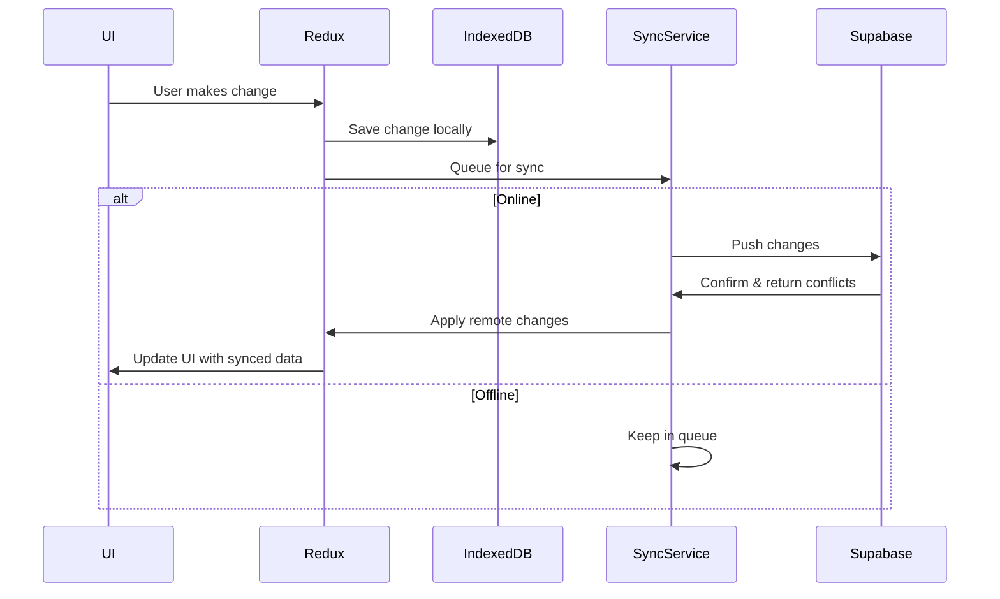

# Multi-Trip Architecture Migration Plan

## Overview

This document outlines the architectural changes needed to transition from a single-trip system to a multi-trip, per-user system with offline-first capabilities and periodic Supabase synchronization.

## Current State Analysis

### Redux Store Structure

Currently, the Redux store is designed around a single trip:

```typescript
export type StoreType = {
  people: Person[];
  defaultItemRules: DefaultItemRule[];
  trip: Trip; // Single trip object
  calculated: {
    defaultItems: Item[];
    packingListItems: PackingListItem[];
  };
  ruleOverrides: RuleOverride[];
  packingListView: PackingListViewState;
  rulePacks: RulePack[];
  ui: {
    /* ... */
  };
  auth: AuthState;
};
```

### Current Trip Model

```typescript
export type Trip = {
  id: string;
  days: Day[];
  tripEvents?: TripEvent[];
};
```

### Key Issues

1. **Single Trip Assumption**: The entire state assumes one active trip
2. **No User Association**: Trip data isn't associated with specific users
3. **No Persistence Strategy**: No mechanism for saving/loading multiple trips
4. **No Trip Management**: No UI for creating, selecting, or managing trips

## Target Architecture

### New Redux Store Structure

```typescript
export type StoreType = {
  // Trip Management
  trips: {
    [tripId: string]: Trip;
  };
  activeTrip: {
    tripId: string | null;
    people: Person[];
    defaultItemRules: DefaultItemRule[];
    calculated: {
      defaultItems: Item[];
      packingListItems: PackingListItem[];
    };
    ruleOverrides: RuleOverride[];
    packingListView: PackingListViewState;
  };

  // Global User Data
  user: {
    id: string | null;
    preferences: UserPreferences;
    rulePacks: RulePack[];
  };

  // Sync Management
  sync: {
    lastSyncTimestamp: number;
    pendingChanges: Change[];
    isOnline: boolean;
    isSyncing: boolean;
    conflicts: SyncConflict[];
  };

  // UI State
  ui: {
    tripSelector: {
      isOpen: boolean;
    };
    rulePackModal: {
      /* existing */
    };
    loginModal: {
      /* existing */
    };
  };

  auth: AuthState;
};
```

### Enhanced Trip Model

```typescript
export type Trip = {
  id: string;
  userId: string;
  title: string;
  description?: string;
  days: Day[];
  tripEvents?: TripEvent[];

  // Metadata
  createdAt: string;
  updatedAt: string;
  lastSyncedAt?: string;

  // Settings
  settings: TripSettings;

  // Sync tracking
  version: number;
  isDeleted: boolean;
};

export type TripSettings = {
  defaultTimeZone: string;
  packingViewMode: 'by-day' | 'by-category';
  // ... other trip-specific settings
};
```

### User Preferences Model

```typescript
export type UserPreferences = {
  defaultTimeZone: string;
  theme: 'light' | 'dark' | 'system';
  defaultTripDuration: number;
  autoSyncEnabled: boolean;
  // ... other global preferences
};
```

### Change Tracking Model

```typescript
export type Change = {
  id: string;
  entityType: 'trip' | 'person' | 'item' | 'rule_override';
  entityId: string;
  operation: 'create' | 'update' | 'delete';
  data: unknown;
  timestamp: number;
  userId: string;
  tripId?: string;
  version: number;
  synced: boolean;
};

export type SyncConflict = {
  id: string;
  entityType: string;
  entityId: string;
  localVersion: unknown;
  serverVersion: unknown;
  conflictType: 'update_conflict' | 'delete_conflict';
  timestamp: number;
};
```

## Database Schema Design

### Supabase Tables

#### Users Table (extends auth.users)

```sql
CREATE TABLE public.user_profiles (
  id UUID REFERENCES auth.users(id) PRIMARY KEY,
  preferences JSONB DEFAULT '{}',
  created_at TIMESTAMPTZ DEFAULT NOW(),
  updated_at TIMESTAMPTZ DEFAULT NOW()
);
```

#### Trips Table

```sql
CREATE TABLE public.trips (
  id UUID DEFAULT gen_random_uuid() PRIMARY KEY,
  user_id UUID REFERENCES auth.users(id) ON DELETE CASCADE,
  title TEXT NOT NULL,
  description TEXT,
  days JSONB DEFAULT '[]',
  trip_events JSONB DEFAULT '[]',
  settings JSONB DEFAULT '{}',
  created_at TIMESTAMPTZ DEFAULT NOW(),
  updated_at TIMESTAMPTZ DEFAULT NOW(),
  version INTEGER DEFAULT 1,
  is_deleted BOOLEAN DEFAULT FALSE,

  CONSTRAINT trips_title_not_empty CHECK (LENGTH(title) > 0)
);
```

#### Trip People Table

```sql
CREATE TABLE public.trip_people (
  id UUID DEFAULT gen_random_uuid() PRIMARY KEY,
  trip_id UUID REFERENCES public.trips(id) ON DELETE CASCADE,
  name TEXT NOT NULL,
  settings JSONB DEFAULT '{}',
  created_at TIMESTAMPTZ DEFAULT NOW(),
  updated_at TIMESTAMPTZ DEFAULT NOW(),
  version INTEGER DEFAULT 1,
  is_deleted BOOLEAN DEFAULT FALSE
);
```

#### Trip Items Table

```sql
CREATE TABLE public.trip_items (
  id UUID DEFAULT gen_random_uuid() PRIMARY KEY,
  trip_id UUID REFERENCES public.trips(id) ON DELETE CASCADE,
  name TEXT NOT NULL,
  category TEXT,
  quantity INTEGER DEFAULT 1,
  packed BOOLEAN DEFAULT FALSE,
  notes TEXT,
  created_at TIMESTAMPTZ DEFAULT NOW(),
  updated_at TIMESTAMPTZ DEFAULT NOW(),
  version INTEGER DEFAULT 1,
  is_deleted BOOLEAN DEFAULT FALSE
);
```

#### Rule Overrides Table

```sql
CREATE TABLE public.trip_rule_overrides (
  id UUID DEFAULT gen_random_uuid() PRIMARY KEY,
  trip_id UUID REFERENCES public.trips(id) ON DELETE CASCADE,
  rule_id TEXT NOT NULL,
  override_data JSONB NOT NULL,
  created_at TIMESTAMPTZ DEFAULT NOW(),
  updated_at TIMESTAMPTZ DEFAULT NOW(),
  version INTEGER DEFAULT 1,
  is_deleted BOOLEAN DEFAULT FALSE
);
```

#### Sync Changes Table (for conflict resolution)

```sql
CREATE TABLE public.sync_changes (
  id UUID DEFAULT gen_random_uuid() PRIMARY KEY,
  user_id UUID REFERENCES auth.users(id) ON DELETE CASCADE,
  entity_type TEXT NOT NULL,
  entity_id UUID NOT NULL,
  operation TEXT NOT NULL,
  data JSONB NOT NULL,
  version INTEGER NOT NULL,
  created_at TIMESTAMPTZ DEFAULT NOW(),
  device_id TEXT,

  INDEX idx_sync_changes_user_timestamp (user_id, created_at),
  INDEX idx_sync_changes_entity (entity_type, entity_id)
);
```

### Row Level Security (RLS) Policies

```sql
-- Enable RLS on all tables
ALTER TABLE public.trips ENABLE ROW LEVEL SECURITY;
ALTER TABLE public.trip_people ENABLE ROW LEVEL SECURITY;
ALTER TABLE public.trip_items ENABLE ROW LEVEL SECURITY;
ALTER TABLE public.trip_rule_overrides ENABLE ROW LEVEL SECURITY;

-- Users can only access their own data
CREATE POLICY "Users can view own trips" ON public.trips
  FOR SELECT USING (auth.uid() = user_id);

CREATE POLICY "Users can insert own trips" ON public.trips
  FOR INSERT WITH CHECK (auth.uid() = user_id);

CREATE POLICY "Users can update own trips" ON public.trips
  FOR UPDATE USING (auth.uid() = user_id);

-- Similar policies for other tables...
```

## Implementation Phases

### Phase 1: Database Setup & User Association (Week 1-2)

#### Tasks:

1. **Create Supabase migrations** for new schema
2. **Implement RLS policies** for data security
3. **Create seed data** for development/testing
4. **Update model types** in `@packing-list/model`
5. **Add user profile management** utilities

#### Deliverables:

- `/supabase/migrations/` - New schema migrations
- Updated model types in `packages/model/`
- User profile management utilities

### Phase 2: Redux Store Refactoring (Week 3-4)

#### Tasks:

1. **Refactor store structure** to support multiple trips
2. **Update actions** to handle trip selection and management
3. **Migrate selectors** to work with active trip concept
4. **Add trip management actions** (create, load, delete, select)
5. **Update state persistence** logic

#### Deliverables:

- Refactored `packages/state/` with new store structure
- Trip management actions and reducers
- Updated selectors for active trip pattern

### Phase 3: Local Storage & Sync Infrastructure (Week 5-6)

#### Tasks:

1. **Implement IndexedDB storage** for offline trip data
2. **Create sync service** for background synchronization
3. **Add change tracking** for local modifications
4. **Implement conflict resolution** logic
5. **Add online/offline detection**

#### Deliverables:

- New `packages/sync/` library
- IndexedDB persistence layer
- Conflict resolution utilities
- Online/offline status management

### Phase 4: Trip Management UI (Week 7-8) ✅ COMPLETED

#### Tasks:

1. **Create trip selector component** for switching trips ✅
2. **Build trip creation wizard** with templates ✅
3. **Add trip settings management** UI ✅
4. **Implement trip deletion** with confirmation ✅
5. **Add trip duplication** functionality ✅
6. **Integrate TripWizard** for comprehensive trip configuration ✅

#### Deliverables:

- Trip selector dropdown/modal ✅
- Trip creation/editing forms with TripWizard integration ✅
- Trip management dashboard ✅
- Trip templates system ✅

#### New Features Added:

**Enhanced Trip Creation Flow:**

- **Template Selection**: Six predefined templates (Business, Vacation, Weekend, Backpacking, Hiking, Custom)
- **Basic Details Form**: Title, description, location fields with validation
- **TripWizard Integration**: Full 4-step wizard for comprehensive trip configuration
  - Step 1: Trip Duration (home departure/arrival dates)
  - Step 2: Destinations (multiple stops with dates and notes)
  - Step 3: Review (timeline visualization)
  - Step 4: Packing Rules (suggested rule packs)
- **Skip Option**: Users can create basic trips without dates for quick setup
- **Auto-navigation**: Returns to home page after successful creation

**User Experience Improvements:**

- **Guided Flow**: Clear step-by-step process from template to full trip configuration
- **Flexible Options**: Choose between comprehensive wizard or quick creation
- **Visual Feedback**: Timeline preview and template cards with clear descriptions
- **Validation**: Form validation with helpful feedback and submit state management

### Phase 5: Migration & Data Sync (Week 9-10)

#### Tasks:

1. ~~**Create migration utility** for existing single-trip data~~ -- not needed, no current data saved in db
2. **Implement initial sync** logic for new usersa
3. **Add sync status indicators** in UI
4. **Create conflict resolution UI** for manual conflicts
5. **Add bulk export/import** for trip data

#### Deliverables:

- Data migration scripts
- Sync status components
- Conflict resolution UI
- Export/import functionality

### Phase 6: Testing & Polish (Week 11-12)

#### Tasks:

1. **Add comprehensive tests** for new functionality
2. **Perform offline scenario testing**
3. **Optimize sync performance**
4. **Add error handling and recovery**
5. **Create user documentation**

#### Deliverables:

- Test suites for multi-trip functionality
- Performance optimizations
- Error handling improvements
- User guide for trip management

## Sync Strategy

### Offline-First Approach

1. **All changes happen locally first**

   - Immediate UI updates
   - Queue changes for sync
   - Work fully offline

2. **Background sync when online**

   - Periodic sync attempts
   - Push local changes
   - Pull remote updates
   - Handle conflicts gracefully

3. **Conflict Resolution**
   - Timestamp-based for simple conflicts
   - Manual resolution UI for complex conflicts
   - Last-writer-wins with user override option

### Sync Flow



## Migration Strategy

### Existing Data Migration

1. **Identify current trip data** in Redux store
2. **Create default trip** with current data
3. **Associate with current user** (if logged in)
4. **Save to local storage** and sync to Supabase
5. **Update UI** to use new trip selector

### User Experience During Migration

1. **Seamless transition** - existing trip becomes "Trip 1"
2. **Automatic backup** - sync existing data before migration
3. **Rollback capability** - ability to revert if issues occur
4. **Progressive enhancement** - new features don't break existing workflow

## Risk Mitigation

### Data Loss Prevention

- **Always save locally first** before syncing
- **Automatic backups** before major operations
- **Conflict preservation** - never auto-delete conflicted data
- **Export functionality** for manual backups

### Performance Considerations

- **Lazy loading** of inactive trips
- **Efficient sync** - only changed entities
- **Background operations** - sync doesn't block UI
- **Pagination** for large trip lists

### Backward Compatibility

- **Graceful degradation** for unsupported features
- **Data format versioning** for future migrations
- **Feature flags** for gradual rollout

## Success Metrics

1. **User can create multiple trips** without data loss
2. **Offline functionality** works seamlessly
3. **Sync conflicts** are resolved appropriately
4. **Performance** remains acceptable with multiple trips
5. **Data integrity** is maintained across sync operations

## Future Enhancements

1. **Trip sharing** between users
2. **Trip templates** and community sharing
3. **Real-time collaboration** on shared trips
4. **Advanced conflict resolution** with branching
5. **Trip analytics** and insights
