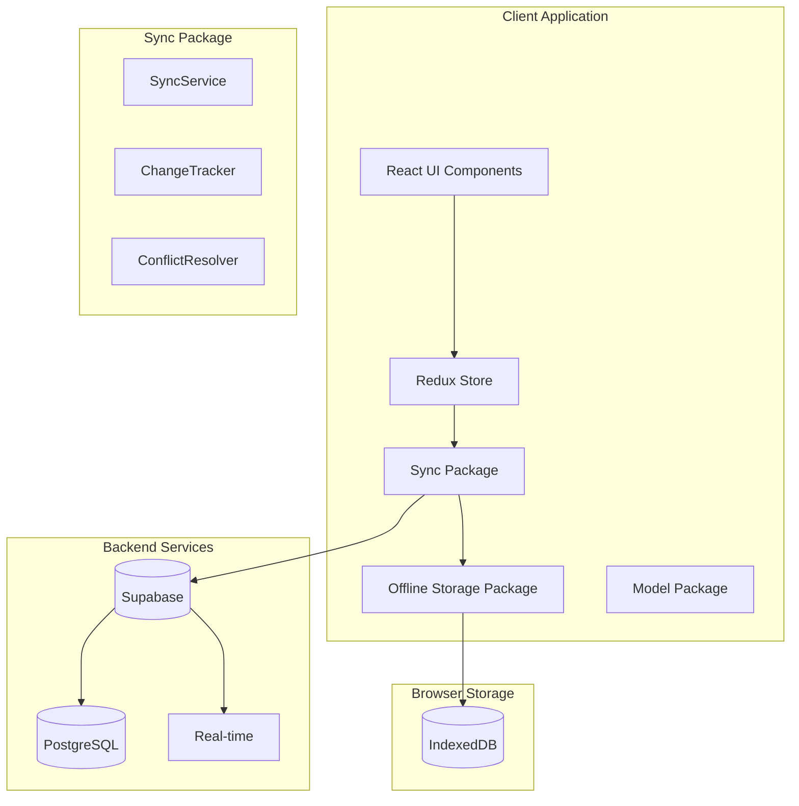
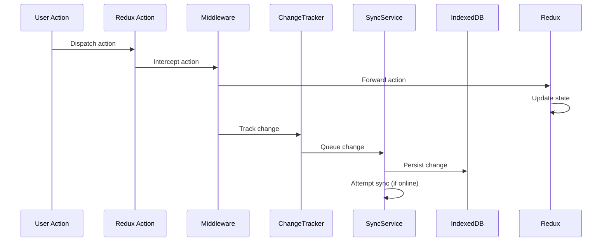
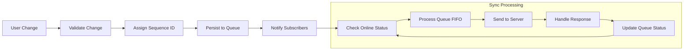

# Sync Infrastructure Architecture

## System Overview

The sync infrastructure is a critical component of the multi-trip packing list application that enables offline-first operation with reliable data synchronization. This document provides a detailed technical overview of the architecture, design decisions, and implementation strategies.

## Design Goals

### Primary Objectives

1. **Offline-First Operation**: Users can work fully offline without degraded functionality
2. **Data Consistency**: Ensure data integrity across multiple devices and users
3. **Conflict Resolution**: Handle concurrent modifications intelligently
4. **Performance**: Minimal impact on user experience during sync operations
5. **Reliability**: Robust error handling and recovery mechanisms

### Non-Functional Requirements

- **Scalability**: Handle hundreds of trips per user efficiently
- **Security**: Protect user data with proper authentication and authorization
- **Maintainability**: Clean, well-documented code with comprehensive testing
- **Extensibility**: Easy to add new entity types and sync strategies

## High-Level Architecture



## Data Flow Architecture

### 1. Change Capture and Tracking

All data modifications flow through a consistent change tracking system:



### 2. Sync State Management

The sync system maintains multiple types of state:

```typescript
interface SyncSystemState {
  // Network state
  connectivity: {
    isOnline: boolean;
    lastOnlineTimestamp: number;
    networkType?: string;
  };

  // Sync operation state
  operations: {
    isSyncing: boolean;
    lastSyncTimestamp: number;
    activeSyncOperations: SyncOperation[];
    failedSyncAttempts: number;
  };

  // Change tracking state
  changes: {
    pendingChanges: Change[];
    syncedChanges: Change[];
    failedChanges: Change[];
  };

  // Conflict management state
  conflicts: {
    activeConflicts: SyncConflict[];
    resolvedConflicts: ResolvedConflict[];
    autoResolutionEnabled: boolean;
  };
}
```

### 3. Offline Queue Management

Changes are queued in a persistent, ordered queue that survives browser restarts:



## Component Deep Dive

### SyncService

The `SyncService` is the central orchestrator that coordinates all synchronization activities.

#### Core Responsibilities

1. **Connection Management**: Monitor online/offline status
2. **Queue Processing**: Manage the change queue and sync operations
3. **State Broadcasting**: Notify subscribers of sync state changes
4. **Error Handling**: Implement retry logic and error recovery
5. **Conflict Detection**: Identify and flag data conflicts

#### Implementation Details

```typescript
class SyncService {
  private state: SyncServiceState;
  private queue: ChangeQueue;
  private network: NetworkMonitor;
  private scheduler: SyncScheduler;
  private subscribers: Set<StateSubscriber>;

  // Core sync loop
  private async syncLoop(): Promise<void> {
    while (this.isRunning) {
      try {
        await this.processPendingChanges();
        await this.pullServerChanges();
        await this.resolveConflicts();
        await this.updateSyncTimestamp();
      } catch (error) {
        await this.handleSyncError(error);
      }

      await this.scheduler.waitForNextSync();
    }
  }

  // Change processing with retry logic
  private async processPendingChanges(): Promise<void> {
    const changes = await this.queue.getPendingChanges();

    for (const change of changes) {
      try {
        await this.syncChange(change);
        await this.queue.markAsSynced(change.id);
      } catch (error) {
        await this.handleChangeError(change, error);
      }
    }
  }
}
```

### ChangeTracker

The `ChangeTracker` provides a high-level API for tracking entity changes while handling the complexity of change serialization and metadata.

#### Entity-Specific Tracking

Each entity type has specialized tracking logic:

```typescript
class ChangeTracker {
  // Trip-specific tracking with metadata preservation
  async trackTripChange(
    operation: ChangeOperation,
    trip: Trip,
    userId: string
  ): Promise<void> {
    const change: Change = {
      id: generateChangeId(),
      entityType: 'trip',
      entityId: trip.id,
      operation,
      data: this.serializeTripData(trip),
      metadata: {
        userId,
        tripId: trip.id,
        version: trip.version,
        timestamp: Date.now(),
        checksum: this.calculateChecksum(trip),
      },
      synced: false,
    };

    await this.syncService.trackChange(change);
  }

  // Specialized serialization for different entity types
  private serializeTripData(trip: Trip): SerializedData {
    return {
      ...trip,
      // Normalize dates to ISO strings
      createdAt: trip.createdAt.toISOString(),
      updatedAt: trip.updatedAt.toISOString(),
      // Handle nested objects
      days: trip.days.map((day) => this.serializeDayData(day)),
      settings: this.serializeSettings(trip.settings),
    };
  }
}
```

### ConflictResolver

The `ConflictResolver` implements sophisticated conflict detection and resolution algorithms.

#### Conflict Analysis Algorithm

```typescript
class ConflictResolver {
  analyzeConflict(conflict: SyncConflict): ConflictAnalysis {
    const localData = conflict.localVersion as EntityData;
    const serverData = conflict.serverVersion as EntityData;

    // Multi-factor conflict analysis
    const analysis: ConflictAnalysis = {
      // Temporal analysis
      temporal: this.analyzeTemporalConflict(localData, serverData),

      // Structural analysis
      structural: this.analyzeStructuralChanges(localData, serverData),

      // Semantic analysis
      semantic: this.analyzeSemanticConflict(localData, serverData),

      // User context analysis
      userContext: this.analyzeUserContext(conflict),

      // Confidence scoring
      confidence: this.calculateConfidenceScore(localData, serverData),
    };

    return analysis;
  }

  // Sophisticated merge algorithm
  createMergedVersion(conflict: SyncConflict): MergedData {
    const analysis = this.analyzeConflict(conflict);

    // Field-level merge based on analysis
    const merged = this.performFieldLevelMerge(
      conflict.localVersion,
      conflict.serverVersion,
      analysis
    );

    // Add merge metadata
    merged._mergeMetadata = {
      strategy: 'automatic',
      confidence: analysis.confidence,
      mergedAt: Date.now(),
      mergedBy: 'system',
      originalVersions: {
        local: conflict.localVersion,
        server: conflict.serverVersion,
      },
    };

    return merged;
  }
}
```

## Persistence Strategy

### IndexedDB Schema Design

The offline storage uses a carefully designed IndexedDB schema optimized for sync operations:

```typescript
interface SyncDatabase {
  // Stores for different entity types
  trips: Trip[];
  people: Person[];
  items: TripItem[];
  ruleOverrides: RuleOverride[];

  // Sync-specific stores
  syncChanges: Change[];
  syncConflicts: SyncConflict[];
  syncMetadata: SyncMetadata[];

  // Indexes for efficient querying
  indexes: {
    // Change tracking indexes
    'syncChanges.synced': boolean;
    'syncChanges.entityType': string;
    'syncChanges.timestamp': number;
    'syncChanges.userId': string;

    // Entity indexes
    'trips.userId': string;
    'trips.updatedAt': number;
    'people.tripId': string;
    'items.tripId': string;
  };
}
```

### Change Serialization

Changes are serialized with comprehensive metadata for reliable sync:

```typescript
interface SerializedChange {
  // Core change data
  id: string;
  sequenceId: number;
  entityType: EntityType;
  entityId: string;
  operation: 'create' | 'update' | 'delete';

  // Change payload
  data: SerializedEntityData;
  previousData?: SerializedEntityData;

  // Metadata
  metadata: {
    userId: string;
    tripId?: string;
    version: number;
    timestamp: number;
    checksum: string;
    deviceId: string;
    clientVersion: string;
  };

  // Sync status
  syncStatus: {
    synced: boolean;
    syncAttempts: number;
    lastSyncAttempt?: number;
    syncError?: string;
  };
}
```

## Network Layer

### Supabase Integration

The sync service integrates with Supabase using a robust network layer:

```typescript
class SupabaseNetworkLayer {
  private client: SupabaseClient;
  private retryPolicy: RetryPolicy;

  async syncChanges(changes: Change[]): Promise<SyncResult> {
    const results: ChangeResult[] = [];

    for (const change of changes) {
      try {
        const result = await this.syncSingleChange(change);
        results.push(result);
      } catch (error) {
        if (this.isConflictError(error)) {
          const conflict = await this.handleConflictError(change, error);
          results.push({ change, conflict });
        } else {
          throw error;
        }
      }
    }

    return { results, timestamp: Date.now() };
  }

  private async syncSingleChange(change: Change): Promise<ChangeResult> {
    switch (change.operation) {
      case 'create':
        return await this.createEntity(change);
      case 'update':
        return await this.updateEntity(change);
      case 'delete':
        return await this.deleteEntity(change);
      default:
        throw new Error(`Unknown operation: ${change.operation}`);
    }
  }
}
```

### Retry and Backoff Strategy

Robust error handling with exponential backoff:

```typescript
class RetryPolicy {
  private readonly maxRetries = 5;
  private readonly baseDelay = 1000; // 1 second
  private readonly maxDelay = 30000; // 30 seconds

  async executeWithRetry<T>(
    operation: () => Promise<T>,
    context: string
  ): Promise<T> {
    let lastError: Error;

    for (let attempt = 0; attempt < this.maxRetries; attempt++) {
      try {
        return await operation();
      } catch (error) {
        lastError = error;

        if (!this.isRetryableError(error) || attempt === this.maxRetries - 1) {
          throw error;
        }

        const delay = this.calculateBackoffDelay(attempt);
        await this.sleep(delay);
      }
    }

    throw lastError;
  }

  private calculateBackoffDelay(attempt: number): number {
    const delay = this.baseDelay * Math.pow(2, attempt);
    const jitter = Math.random() * 0.1 * delay;
    return Math.min(delay + jitter, this.maxDelay);
  }
}
```

## Performance Optimizations

### Batching and Deduplication

```typescript
class SyncOptimizer {
  // Batch similar changes to reduce network requests
  async batchChanges(changes: Change[]): Promise<ChangesBatch[]> {
    const batches = new Map<string, Change[]>();

    for (const change of changes) {
      const batchKey = this.getBatchKey(change);
      const batch = batches.get(batchKey) || [];
      batch.push(change);
      batches.set(batchKey, batch);
    }

    return Array.from(batches.values()).map((changes) => ({
      id: generateBatchId(),
      changes,
      entityType: changes[0].entityType,
      totalSize: this.calculateBatchSize(changes),
    }));
  }

  // Deduplicate redundant changes
  async deduplicateChanges(changes: Change[]): Promise<Change[]> {
    const entityChangeMap = new Map<string, Change>();

    // Sort by timestamp to keep latest changes
    const sortedChanges = changes.sort((a, b) => b.timestamp - a.timestamp);

    for (const change of sortedChanges) {
      const key = `${change.entityType}:${change.entityId}`;

      if (!entityChangeMap.has(key)) {
        entityChangeMap.set(key, change);
      }
    }

    return Array.from(entityChangeMap.values());
  }
}
```

### Incremental Sync

```typescript
class IncrementalSync {
  async pullIncrementalChanges(lastSyncTimestamp: number): Promise<Change[]> {
    // Only fetch changes newer than last sync
    const serverChanges = await this.networkLayer.getChanges({
      since: lastSyncTimestamp,
      userId: this.getCurrentUserId(),
      limit: this.batchSize,
    });

    // Apply changes to local storage
    const appliedChanges: Change[] = [];

    for (const change of serverChanges) {
      try {
        await this.applyServerChange(change);
        appliedChanges.push(change);
      } catch (error) {
        await this.handleApplyError(change, error);
      }
    }

    return appliedChanges;
  }
}
```

## Security Model

### Authentication Integration

```typescript
class SyncSecurity {
  private authState: AuthState;

  async authenticateSync(): Promise<SyncCredentials> {
    if (!this.authState.isAuthenticated) {
      throw new SyncError('User must be authenticated to sync');
    }

    // Refresh token if needed
    if (this.authState.tokenExpiresAt < Date.now() + 60000) {
      // 1 minute buffer
      await this.authState.refreshToken();
    }

    return {
      accessToken: this.authState.accessToken,
      userId: this.authState.userId,
      permissions: this.authState.permissions,
    };
  }

  // Validate user permissions for each change
  async validateChangePermissions(change: Change): Promise<boolean> {
    const credentials = await this.authenticateSync();

    // User can only modify their own data
    if (change.userId !== credentials.userId) {
      return false;
    }

    // Additional permission checks based on entity type
    return this.validateEntityPermissions(change, credentials);
  }
}
```

### Data Validation

```typescript
class SyncValidator {
  async validateChange(change: Change): Promise<ValidationResult> {
    const errors: ValidationError[] = [];

    // Schema validation
    const schemaErrors = await this.validateSchema(change);
    errors.push(...schemaErrors);

    // Business rule validation
    const businessErrors = await this.validateBusinessRules(change);
    errors.push(...businessErrors);

    // Data integrity validation
    const integrityErrors = await this.validateDataIntegrity(change);
    errors.push(...integrityErrors);

    return {
      isValid: errors.length === 0,
      errors,
    };
  }
}
```

## Error Handling and Recovery

### Error Classification

```typescript
enum SyncErrorType {
  NETWORK_ERROR = 'network',
  AUTHENTICATION_ERROR = 'auth',
  VALIDATION_ERROR = 'validation',
  CONFLICT_ERROR = 'conflict',
  STORAGE_ERROR = 'storage',
  UNKNOWN_ERROR = 'unknown',
}

class SyncErrorHandler {
  async handleError(
    error: Error,
    context: SyncContext
  ): Promise<ErrorResolution> {
    const errorType = this.classifyError(error);

    switch (errorType) {
      case SyncErrorType.NETWORK_ERROR:
        return await this.handleNetworkError(error, context);

      case SyncErrorType.AUTHENTICATION_ERROR:
        return await this.handleAuthError(error, context);

      case SyncErrorType.CONFLICT_ERROR:
        return await this.handleConflictError(error, context);

      default:
        return await this.handleUnknownError(error, context);
    }
  }
}
```

### Recovery Strategies

```typescript
class SyncRecovery {
  async recoverFromFailure(failure: SyncFailure): Promise<RecoveryResult> {
    switch (failure.type) {
      case 'partial_sync':
        return await this.recoverPartialSync(failure);

      case 'data_corruption':
        return await this.recoverDataCorruption(failure);

      case 'version_mismatch':
        return await this.recoverVersionMismatch(failure);

      default:
        return await this.fullResync();
    }
  }

  // Complete resync as last resort
  private async fullResync(): Promise<RecoveryResult> {
    // Clear local change queue
    await this.clearLocalChanges();

    // Re-download all data from server
    const serverData = await this.downloadAllUserData();

    // Rebuild local storage
    await this.rebuildLocalStorage(serverData);

    // Reset sync state
    await this.resetSyncState();

    return { success: true, strategy: 'full_resync' };
  }
}
```

## Testing Strategy

### Unit Testing

```typescript
describe('SyncService', () => {
  let mockNetwork: MockNetworkLayer;
  let mockStorage: MockStorage;
  let syncService: SyncService;

  beforeEach(() => {
    mockNetwork = new MockNetworkLayer();
    mockStorage = new MockStorage();
    syncService = new SyncService({
      network: mockNetwork,
      storage: mockStorage,
    });
  });

  it('should handle offline queue correctly', async () => {
    // Simulate offline state
    mockNetwork.setOnline(false);

    // Track changes while offline
    await syncService.trackChange(createMockChange());

    // Verify change is queued
    const state = await syncService.getSyncState();
    expect(state.pendingChanges).toHaveLength(1);

    // Simulate going online
    mockNetwork.setOnline(true);

    // Wait for sync to complete
    await syncService.forceSync();

    // Verify change was synced
    expect(mockNetwork.getSyncedChanges()).toHaveLength(1);
  });
});
```

### Integration Testing

```typescript
describe('End-to-End Sync', () => {
  let testDatabase: TestDatabase;
  let syncService: SyncService;

  beforeEach(async () => {
    testDatabase = await createTestDatabase();
    syncService = new SyncService({
      supabaseUrl: TEST_SUPABASE_URL,
      supabaseKey: TEST_SUPABASE_KEY,
    });
  });

  it('should sync changes across multiple clients', async () => {
    // Client A makes changes
    const clientA = createSyncClient('user-1');
    await clientA.trackTripChange('create', mockTrip);
    await clientA.forceSync();

    // Client B should receive changes
    const clientB = createSyncClient('user-1');
    await clientB.forceSync();

    const trips = await clientB.getTrips();
    expect(trips).toContainEqual(
      expect.objectContaining({
        id: mockTrip.id,
      })
    );
  });
});
```

## Monitoring and Observability

### Metrics Collection

```typescript
class SyncMetrics {
  private metrics: MetricsCollector;

  trackSyncOperation(operation: SyncOperation): void {
    this.metrics.increment('sync.operations.total', {
      operation: operation.type,
      status: operation.status,
    });

    this.metrics.timing('sync.operation.duration', operation.duration, {
      operation: operation.type,
    });
  }

  trackConflictResolution(
    conflict: SyncConflict,
    resolution: ConflictResolution
  ): void {
    this.metrics.increment('sync.conflicts.resolved', {
      entityType: conflict.entityType,
      strategy: resolution.strategy,
    });
  }
}
```

### Health Monitoring

```typescript
class SyncHealthMonitor {
  async getHealthStatus(): Promise<HealthStatus> {
    const [queueHealth, networkHealth, storageHealth, conflictHealth] =
      await Promise.all([
        this.checkQueueHealth(),
        this.checkNetworkHealth(),
        this.checkStorageHealth(),
        this.checkConflictHealth(),
      ]);

    return {
      overall: this.calculateOverallHealth([
        queueHealth,
        networkHealth,
        storageHealth,
        conflictHealth,
      ]),
      components: {
        queue: queueHealth,
        network: networkHealth,
        storage: storageHealth,
        conflicts: conflictHealth,
      },
      timestamp: Date.now(),
    };
  }
}
```

## Future Enhancements

### Real-time Collaboration

```typescript
class RealtimeSync {
  private websocket: WebSocket;
  private operationalTransform: OperationalTransform;

  async enableRealtime(): Promise<void> {
    this.websocket = await this.createWebSocketConnection();

    this.websocket.onmessage = (event) => {
      const change = JSON.parse(event.data);
      this.handleRealtimeChange(change);
    };
  }

  private async handleRealtimeChange(change: Change): Promise<void> {
    // Apply operational transformation
    const transformedChange = await this.operationalTransform.transform(
      change,
      this.getLocalChanges()
    );

    // Apply to local state
    await this.applyChange(transformedChange);
  }
}
```

### Advanced Conflict Resolution

```typescript
class AdvancedConflictResolver {
  async resolveWithAI(conflict: SyncConflict): Promise<ResolvedConflict> {
    // Use AI/ML to suggest resolutions
    const aiSuggestion = await this.aiService.analyzeConflict(conflict);

    // Combine with traditional heuristics
    const traditionalAnalysis = this.analyzeConflict(conflict);

    // Create hybrid resolution
    return this.createHybridResolution(aiSuggestion, traditionalAnalysis);
  }
}
```

This architecture provides a robust foundation for offline-first synchronization while maintaining flexibility for future enhancements and scaling requirements.
