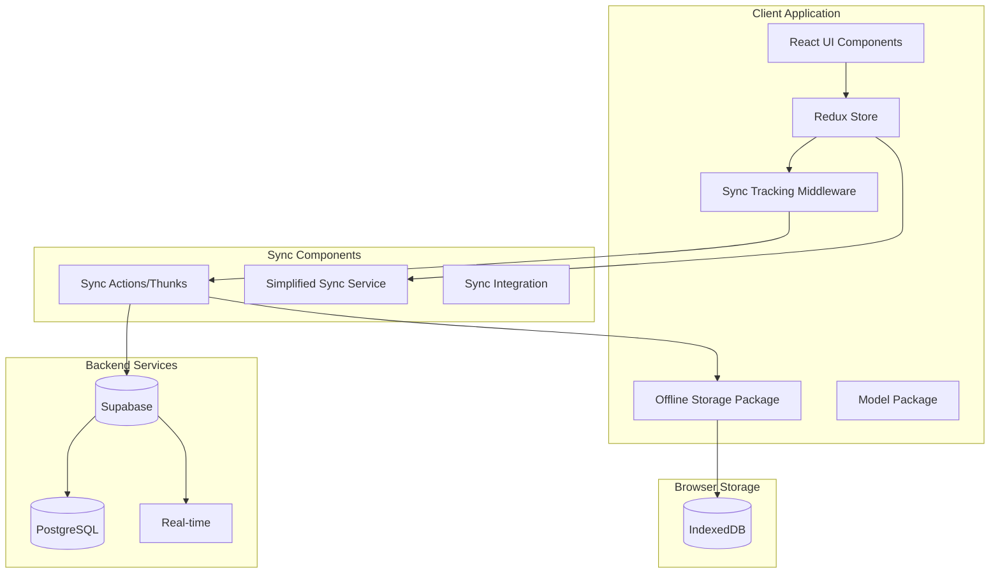
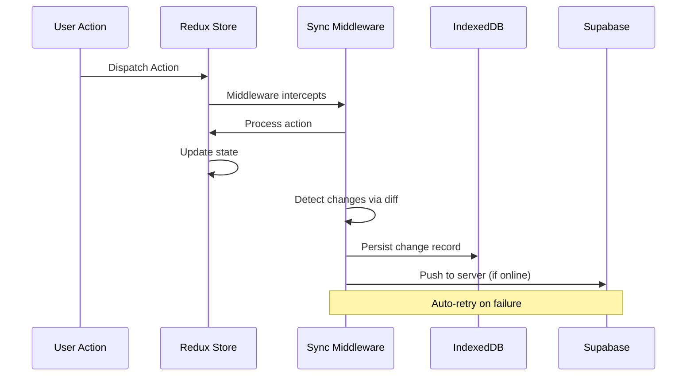
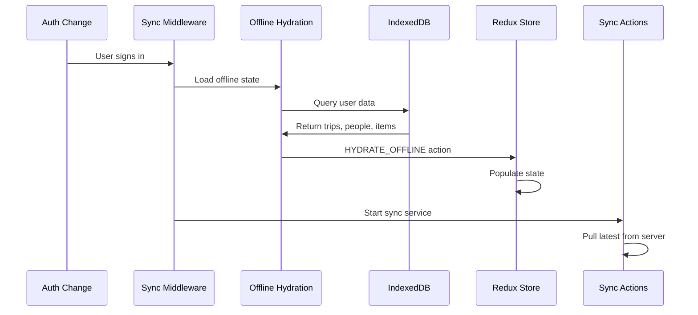

# Sync Infrastructure Architecture

## System Overview

The sync infrastructure has evolved into a **simplified, middleware-based system** that provides offline-first operation with reliable data synchronization. The architecture has shifted from a complex service-oriented design to a Redux-middleware-centered approach for better integration with the application state.

## Design Goals

### Primary Objectives

1. **Offline-First Operation**: Users can work fully offline without degraded functionality
2. **Data Consistency**: Ensure data integrity across multiple devices and users
3. **Conflict Resolution**: Handle concurrent modifications with smart auto-resolution
4. **Performance**: Minimal impact on user experience during sync operations
5. **Reliability**: Robust error handling and recovery mechanisms
6. **Simplicity**: Reduced complexity compared to the previous architecture

### Non-Functional Requirements

- **Scalability**: Handle hundreds of trips per user efficiently
- **Security**: Protect user data with proper authentication and authorization
- **Maintainability**: Clean, well-documented code with comprehensive testing
- **Extensibility**: Easy to add new entity types and sync strategies

## Current Architecture Overview

The sync system now consists of three main components:



## Data Flow Architecture

### 1. Change Capture and Tracking (Middleware-Based)

All data modifications are captured by the sync tracking middleware:



### 2. Offline Hydration System

When users sign in or the app starts, data is loaded from IndexedDB:



### 3. Sync State Management

The sync system maintains state through Redux:

```typescript
interface SyncState {
  // Sync metadata
  syncState: {
    lastSyncTimestamp: number | null;
    pendingChanges: Change[];
    isOnline: boolean;
    isSyncing: boolean;
    conflicts: SyncConflict[];
  };

  // Initialization state
  isInitialized: boolean;
  lastError: string | null;
}
```

## Component Deep Dive

### Sync Tracking Middleware

The middleware is the core of the new architecture, replacing the complex service layer:

```typescript
export const syncTrackingMiddleware: Middleware<object, StoreType> =
  (store) => (next) => (action) => {
    const prevState = store.getState();
    const result = next(action); // Process action first
    const nextState = store.getState();

    // Handle auth changes - reload from IndexedDB and start sync
    const userChanged = prevState.auth.user?.id !== nextState.auth.user?.id;
    if (userChanged && nextState.auth.user?.id) {
      // Reload from IndexedDB and start sync service
      reloadFromIndexedDB(store.dispatch, nextState.auth.user.id);
    }

    // Track changes for non-local users
    if (shouldTrackChanges(action, nextState)) {
      trackAllChanges(
        prevState,
        nextState,
        nextState.trips.selectedTripId,
        nextState.auth.user.id
      );
    }

    return result;
  };
```

#### Key Responsibilities:

1. **Change Detection**: Uses state diffing to detect entity changes
2. **Persistence**: Saves changes to IndexedDB immediately
3. **Server Push**: Attempts to push changes to Supabase
4. **Auth Handling**: Manages IndexedDB reload on user sign-in
5. **Error Handling**: Implements retry logic and graceful failures

### Simplified Sync Service

The SyncService has been dramatically simplified:

```typescript
export class SyncService {
  private connectivityService: ConnectivityService;
  private subscribers: ((state: SyncState) => void)[] = [];

  // Core methods
  async getSyncState(): Promise<SyncState> {
    /* ... */
  }
  async resolveConflict(
    conflictId: string,
    resolution: 'local' | 'server'
  ): Promise<void> {
    /* ... */
  }
  subscribe(callback: (state: SyncState) => void): () => void {
    /* ... */
  }
}
```

#### Reduced Responsibilities:

- ❌ No longer handles change tracking (moved to middleware)
- ❌ No longer manages sync loops (handled by thunks)
- ❌ No longer manages queues (simplified to immediate processing)
- ✅ Provides sync state queries
- ✅ Handles conflict resolution
- ✅ Manages subscriptions

### Sync Actions & Thunks

Server communication is handled through Redux async thunks:

```typescript
// Pull data from server
export const syncFromServer = createAsyncThunk(
  'sync/syncFromServer',
  async (params: { userId: string; since?: string }, { dispatch }) => {
    // Pull all entity types in parallel
    const [trips, people, items, rules] = await Promise.all([
      dispatch(pullTripsFromServer(params)),
      dispatch(pullPeopleFromServer(params)),
      dispatch(pullItemsFromServer(params)),
      dispatch(pullDefaultItemRulesFromServer(params)),
    ]);

    return { trips, people, items, rules };
  }
);

// Push individual changes
export const pushChangeToServer = async (change: Change): Promise<void> => {
  switch (change.entityType) {
    case 'trip':
      return pushTripChange(change);
    case 'person':
      return pushPersonChange(change);
    case 'item':
      return pushItemChange(change);
    // ... etc
  }
};
```

### Conflict Resolution System

The conflict resolution has been enhanced with smart auto-resolution:

```typescript
function resolveTimestampOnlyConflict<T>(local: T, server: T): T | null {
  // Exclude timestamp fields from comparison
  const excludeFields = ['updatedAt', 'createdAt', 'timestamp', 'version'];

  // Deep compare non-timestamp fields
  if (deepEqual(localFiltered, serverFiltered)) {
    console.log('✅ Timestamp-only conflict - auto-resolving');
    return server; // Use server timestamp
  }

  console.log('❌ Real data conflict - requires manual resolution');
  return null;
}
```

## Key Architectural Changes

### What Changed From Previous Design:

1. **❌ Removed Complex Service Layer**: No more SyncService orchestration loops
2. **❌ Removed Queue Management**: Changes are processed immediately, not queued
3. **❌ Removed Background Sync Loops**: Replaced with event-driven sync
4. **✅ Added Middleware-Based Tracking**: Changes detected via state diffs
5. **✅ Added Smart Conflict Resolution**: Auto-resolves timestamp-only conflicts
6. **✅ Added Demo Data Preservation**: HYDRATE_OFFLINE preserves demo trips
7. **✅ Added IndexedDB-First Design**: All data persisted locally first

### Benefits of New Architecture:

- **Simpler**: Fewer moving parts, easier to debug
- **More Reliable**: Immediate persistence, no queue corruption
- **Better Performance**: No background polling, event-driven
- **Better Integration**: Tightly coupled with Redux state
- **More Resilient**: Local-first with automatic fallbacks

### Trade-offs:

- **Less Sophisticated Queuing**: No complex retry strategies
- **No Background Sync**: Sync happens on user actions only
- **Tighter Coupling**: Sync logic more integrated with app state

## Persistence Strategy

### IndexedDB Schema (Unchanged)

The schema remains the same but usage patterns have changed:

```typescript
interface SyncDatabase {
  // Entity stores
  trips: Trip[];
  people: Person[];
  items: TripItem[];

  // Sync tracking (simplified)
  syncChanges: Change[]; // Still used but simpler
  syncMetadata: { lastSyncTimestamp: number };
}
```

### Change Tracking (Simplified)

Changes are now tracked with simpler metadata:

```typescript
interface Change {
  id: string;
  entityType: 'trip' | 'person' | 'item' | 'default_item_rule' | 'trip_rule';
  entityId: string;
  operation: 'create' | 'update' | 'delete';
  userId: string;
  tripId?: string;
  version: number;
  timestamp: number;
  synced: boolean;
  data: SerializedEntityData;
}
```

## Network Layer

### Supabase Integration (Streamlined)

Direct Supabase calls from thunks, no abstraction layer:

```typescript
// Example: Pull trips
const { data: trips, error } = await supabase
  .from('trips')
  .select('*')
  .eq('user_id', params.userId)
  .gt('updated_at', since)
  .eq('is_deleted', false);

// Process and handle conflicts inline
for (const serverTrip of trips || []) {
  const localTrip = await TripStorage.getTrip(serverTrip.id);
  if (hasConflict(localTrip, serverTrip)) {
    // Handle conflict resolution
  }
}
```

## Testing Strategy

### Current Testing Approach:

1. **Unit Tests**: Test individual components (middleware, actions, utils)
2. **Integration Tests**: Test sync flows end-to-end
3. **E2E Tests**: Test user scenarios with demo data

### Key Test Cases:

- Middleware change detection
- Offline hydration with demo data preservation
- Conflict resolution (auto and manual)
- Network failure handling
- Auth state changes

## Demo Data Handling

A critical feature is preservation of demo data during auth changes:

```typescript
export const hydrateOfflineHandler = (state, action) => {
  // Preserve demo trips from being cleared by IndexedDB reload
  const currentDemoTrips = Object.entries(state.trips.byId).filter(([tripId]) =>
    isDemoTripId(tripId)
  );

  const hydratedState = { ...state, ...action.payload };

  if (currentDemoTrips.length > 0) {
    // Merge demo trips back into hydrated state
    hydratedState.trips.byId = {
      ...hydratedState.trips.byId,
      ...Object.fromEntries(currentDemoTrips),
    };
  }

  return hydratedState;
};
```

## Future Considerations

### Potential Enhancements:

1. **Real-time Sync**: Add WebSocket support for live collaboration
2. **Optimistic UI**: More sophisticated optimistic updates
3. **Background Sync**: Service worker integration for background processing
4. **Conflict UI**: Better user interfaces for manual conflict resolution
5. **Metrics**: Add comprehensive sync monitoring and analytics

### Migration Notes:

This architecture represents a significant shift towards simplicity and reliability. The previous complex service layer has been replaced with a more integrated, middleware-based approach that provides better performance and easier maintenance.
