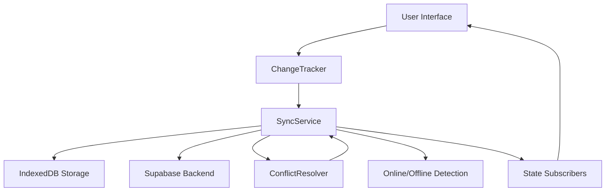
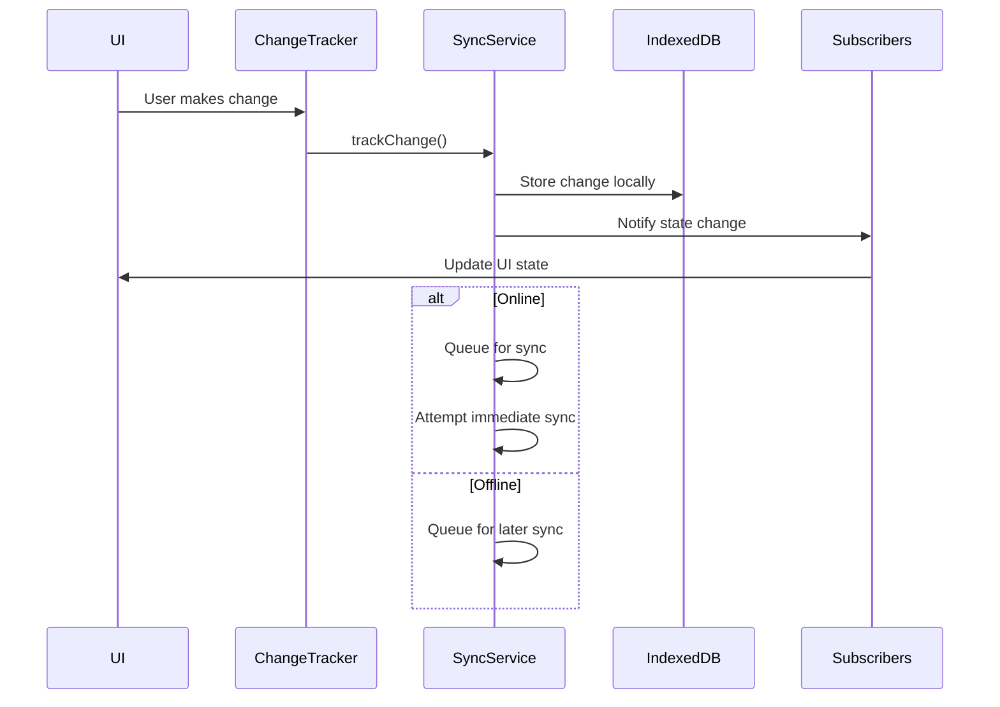
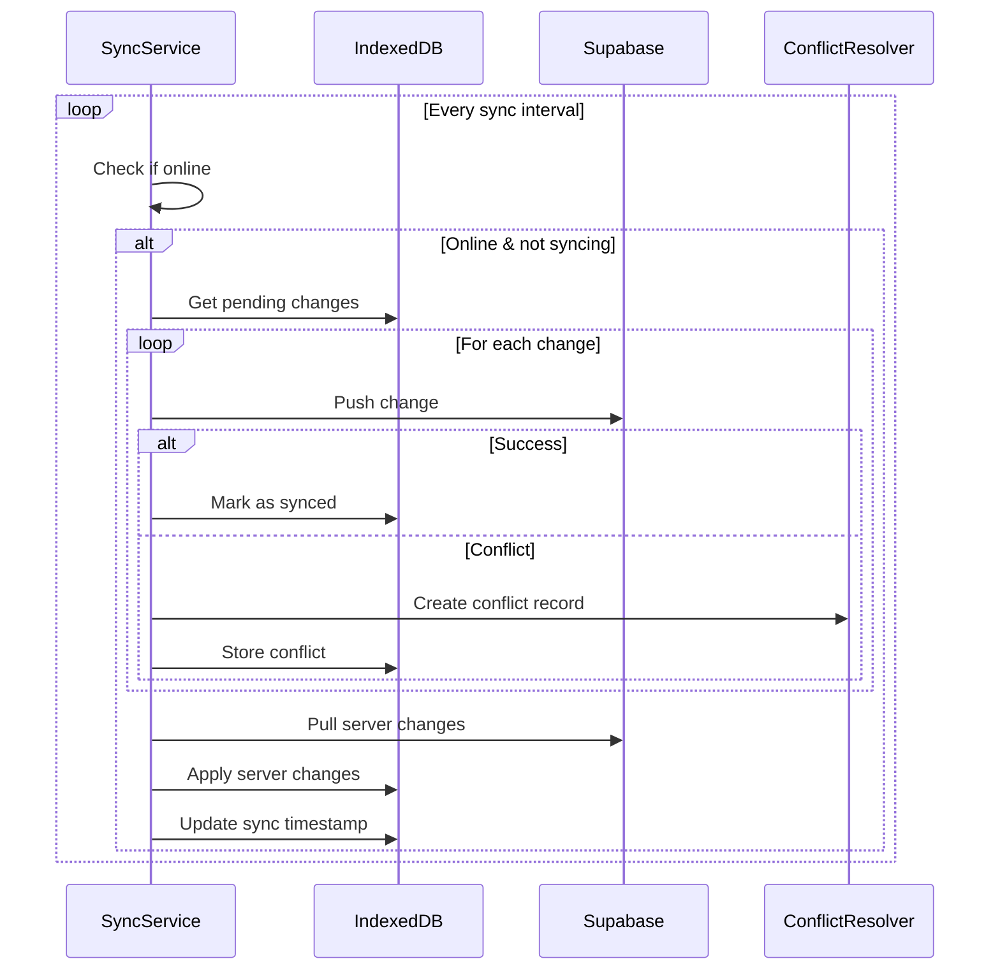
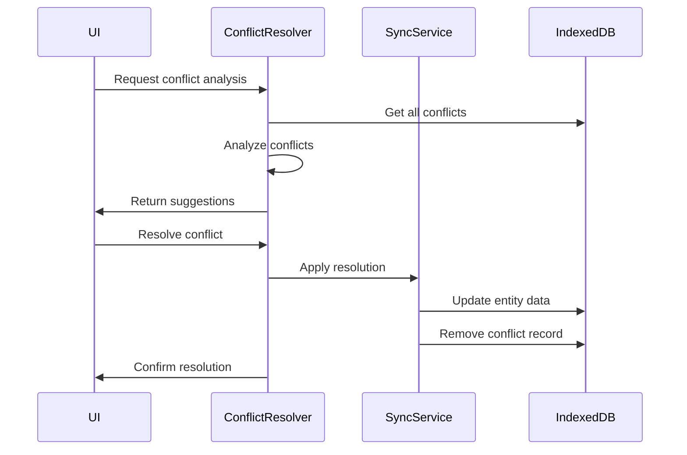

# Sync Infrastructure Documentation

## Overview

The `@packing-list/sync` package provides a comprehensive offline-first synchronization infrastructure for the multi-trip packing list application. It enables seamless data synchronization between local IndexedDB storage and remote Supabase backend, with intelligent conflict resolution and robust offline capabilities.

## Architecture

### Core Principles

1. **Offline-First**: All changes happen locally first, ensuring the app works without internet
2. **Background Sync**: Automatic synchronization when online, without blocking user interactions
3. **Conflict Resolution**: Intelligent handling of data conflicts with multiple resolution strategies
4. **Change Tracking**: Comprehensive tracking of all modifications for reliable sync
5. **Event-Driven**: Reactive architecture with state change notifications

### System Components



## Core Components

### 1. SyncService

The central orchestrator of all synchronization activities.

#### Key Features

- **Online/Offline Detection**: Monitors network connectivity
- **Background Sync**: Configurable auto-sync intervals
- **Change Queue Management**: Tracks pending changes
- **Conflict Detection**: Identifies data conflicts during sync
- **State Management**: Provides current sync state to subscribers

#### Configuration

```typescript
const syncService = new SyncService({
  supabaseUrl: 'https://your-project.supabase.co',
  supabaseAnonKey: 'your-anon-key',
  autoSyncInterval: 30000, // 30 seconds
});
```

#### Core Methods

```typescript
// Initialize and start the service
await syncService.start();

// Track a local change
await syncService.trackChange({
  entityType: 'trip',
  entityId: 'trip-123',
  operation: 'update',
  data: tripData,
  userId: 'user-456',
  version: 2,
});

// Force manual sync
await syncService.forceSync();

// Subscribe to state changes
const unsubscribe = syncService.subscribe((state) => {
  console.log('Sync state:', state);
});

// Stop the service
syncService.stop();
```

### 2. ChangeTracker

High-level utility for tracking entity-specific changes.

#### Entity Support

- **Trips**: Complete trip data with metadata
- **People**: Trip participants with settings
- **Items**: Packing list items with status
- **Rule Overrides**: Custom packing rules

#### Usage Examples

```typescript
import { getChangeTracker } from '@packing-list/sync';

const tracker = getChangeTracker();

// Track trip changes
await tracker.trackTripChange('create', trip, userId);
await tracker.trackTripChange('update', trip, userId);
await tracker.trackTripChange('delete', trip, userId);

// Track person changes
await tracker.trackPersonChange('create', person, userId, tripId);

// Track item changes
await tracker.trackItemChange('update', item, userId, tripId);

// Optimized packing status tracking
await tracker.trackPackingStatusChange(itemId, true, userId, tripId);

// Bulk packing operations
await tracker.trackBulkPackingChanges(
  [
    { itemId: 'item-1', isPacked: true, previousStatus: false },
    { itemId: 'item-2', isPacked: true, previousStatus: false },
    { itemId: 'item-3', isPacked: false, previousStatus: true },
  ],
  userId,
  tripId
);

// Check sync status
const hasPending = await tracker.hasPendingChanges();
const hasConflicts = await tracker.hasConflicts();
const pendingPackingChanges = await tracker.getPendingPackingChanges();
```

### 3. ConflictResolver

Intelligent conflict resolution with multiple strategies.

#### Resolution Strategies

1. **Automatic Resolution**

   - **Timestamp-based**: Prefer more recent changes
   - **Data completeness**: Prefer versions with more data
   - **Heuristic scoring**: Confidence-based suggestions

2. **Manual Resolution**
   - **Local preference**: Keep local changes
   - **Server preference**: Accept server changes
   - **Custom merge**: User-defined resolution

#### Conflict Analysis

```typescript
import { getConflictResolver } from '@packing-list/sync';

const resolver = getConflictResolver();

// Get all conflicts
const conflicts = await resolver.getConflicts();

// Analyze conflicts with suggestions
const analysis = await resolver.analyzeConflicts();
analysis.forEach(({ conflict, suggestedStrategy, confidence }) => {
  console.log(`Conflict: ${conflict.entityType}:${conflict.entityId}`);
  console.log(`Suggestion: ${suggestedStrategy.strategy} (${confidence})`);
  console.log(`Reason: ${suggestedStrategy.reason}`);
});

// Resolve individual conflict
await resolver.resolveConflict(conflictId, {
  strategy: 'local',
  reason: 'User prefers local changes',
});

// Bulk resolution
await resolver.resolveAllConflicts('server');

// Smart merge resolution
await resolver.resolveWithMerge(conflictId);
```

## Packing Status Tracking

The sync infrastructure provides specialized optimizations for tracking packing status changes, which are typically the most frequent operations in a packing list application.

### Why Packing Needs Special Handling

Packing/unpacking actions have unique characteristics:

- **High Frequency**: Users often pack/unpack multiple items quickly
- **Low Conflict Risk**: Packing status conflicts are rare and easily resolved
- **Lightweight Data**: Only the `packed` boolean needs to be synchronized
- **Batch Operations**: Users may pack entire categories at once

### Optimized Packing Methods

#### Individual Packing Status Changes

```typescript
import { getChangeTracker } from '@packing-list/sync';

const tracker = getChangeTracker();

// Lightweight packing status update
await tracker.trackPackingStatusChange(
  'item-123',
  true, // isPacked
  userId,
  tripId,
  {
    previousStatus: false, // Optional: for undo functionality
    timestamp: Date.now(), // Optional: custom timestamp
  }
);
```

#### Bulk Packing Operations

```typescript
// Efficient bulk packing (e.g., "Pack all clothes")
const packingChanges = [
  { itemId: 'shirt-1', isPacked: true, previousStatus: false },
  { itemId: 'pants-1', isPacked: true, previousStatus: false },
  { itemId: 'socks-1', isPacked: true, previousStatus: false },
];

await tracker.trackBulkPackingChanges(packingChanges, userId, tripId);
```

#### Integration with Redux Actions

```typescript
// Enhanced Redux middleware for packing
const packingOptimizedSyncMiddleware: Middleware = (store) => (next) => {
  const tracker = getChangeTracker();

  return async (action) => {
    const result = next(action);

    if (action.type === 'TOGGLE_ITEM_PACKED') {
      const state = store.getState();
      const item = findItemById(state, action.payload.itemId);

      if (item) {
        // Use optimized packing tracking
        await tracker.trackPackingStatusChange(
          item.id,
          item.isPacked,
          state.auth.userId,
          state.selectedTripId,
          {
            previousStatus: !item.isPacked,
          }
        );
      }
    } else if (action.type === 'BULK_PACK_ITEMS') {
      // Handle bulk operations efficiently
      await tracker.trackBulkPackingChanges(
        action.payload.changes,
        state.auth.userId,
        state.selectedTripId
      );
    }

    return result;
  };
};
```

### Performance Benefits

1. **Reduced Sync Overhead**: Packing changes use minimal data payloads
2. **Batch Processing**: Multiple packing actions are grouped into single sync operations
3. **Conflict Avoidance**: Specialized conflict resolution for packing status
4. **Offline Resilience**: Packing changes are queued efficiently for later sync

### Conflict Resolution for Packing

Packing conflicts are resolved with simple last-writer-wins logic:

```typescript
// Automatic conflict resolution for packing status
class PackingConflictResolver {
  resolvePacking(conflict: SyncConflict): ConflictResolution {
    const localStatus = conflict.localVersion.packed;
    const serverStatus = conflict.serverVersion.packed;

    // If both are packed or both unpacked, no real conflict
    if (localStatus === serverStatus) {
      return { strategy: 'auto', data: conflict.localVersion };
    }

    // Prefer packed status (user likely made progress)
    return {
      strategy: 'auto',
      data: { ...conflict.localVersion, packed: localStatus || serverStatus },
      reason: 'Prefer packed status to maintain progress',
    };
  }
}
```

### Monitoring Packing Sync

```typescript
// Track packing-specific metrics
const syncState = await syncService.getSyncState();
const packingChanges = await tracker.getPendingPackingChanges();

console.log(`${packingChanges} packing changes pending sync`);

// Subscribe to packing-specific updates
syncService.subscribe((state) => {
  const packingPending = state.pendingChanges.filter(
    (change) => change.entityType === 'item' && change.data._packingStatusOnly
  ).length;

  updatePackingSyncIndicator(packingPending);
});
```

## Data Flow

### 1. Local Change Flow



### 2. Background Sync Flow



### 3. Conflict Resolution Flow



## Sync States

The sync service maintains comprehensive state information:

```typescript
interface SyncState {
  lastSyncTimestamp: number;
  pendingChanges: Change[];
  isOnline: boolean;
  isSyncing: boolean;
  conflicts: SyncConflict[];
}
```

### State Meanings

- **lastSyncTimestamp**: When sync last completed successfully
- **pendingChanges**: Changes waiting to be synchronized
- **isOnline**: Current network connectivity status
- **isSyncing**: Whether sync operation is in progress
- **conflicts**: Unresolved data conflicts

## Integration Patterns

### React Hook Integration

```typescript
import { useSyncState } from './hooks/useSyncState';

function SyncStatusComponent() {
  const { state, isOnline, isSyncing, pendingCount, conflictCount, forceSync } =
    useSyncState();

  return (
    <div className="sync-status">
      <div>Status: {isOnline ? 'Online' : 'Offline'}</div>
      {isSyncing && <div>Syncing...</div>}
      {pendingCount > 0 && <div>{pendingCount} pending changes</div>}
      {conflictCount > 0 && <div>{conflictCount} conflicts</div>}
      <button onClick={forceSync}>Force Sync</button>
    </div>
  );
}
```

### Redux Integration

```typescript
// Sync middleware
const syncMiddleware: Middleware = (store) => (next) => {
  const tracker = getChangeTracker();

  return (action) => {
    const result = next(action);

    // Track relevant changes
    if (action.type.startsWith('trip/')) {
      const state = store.getState();
      tracker.trackTripChange(
        action.type.includes('create') ? 'create' : 'update',
        state.trip,
        state.auth.userId
      );
    }

    return result;
  };
};
```

### Service Worker Integration

```typescript
// Background sync when app is closed
self.addEventListener('sync', async (event) => {
  if (event.tag === 'background-sync') {
    event.waitUntil(
      initializeSyncService().then((service) => service.forceSync())
    );
  }
});
```

## Error Handling

### Network Errors

- Automatic retry with exponential backoff
- Offline queue management
- Connection restoration detection

### Data Errors

- Validation before sync attempts
- Schema migration support
- Corrupted data recovery

### Conflict Errors

- Automatic conflict detection
- User notification systems
- Fallback resolution strategies

## Performance Optimizations

### Batch Operations

```typescript
// Batch multiple changes
const changes = [
  { entityType: 'item', entityId: '1', operation: 'update', ... },
  { entityType: 'item', entityId: '2', operation: 'update', ... },
  { entityType: 'item', entityId: '3', operation: 'create', ... }
];

// Track as batch to reduce sync overhead
await Promise.all(changes.map(change =>
  syncService.trackChange(change)
));
```

### Selective Sync

```typescript
// Only sync specific entity types
const tripChanges = await getPendingChanges('trip');
const personChanges = await getPendingChanges('person');

// Prioritize critical changes
await syncService.syncChanges(tripChanges);
```

### Incremental Updates

- Delta synchronization for large objects
- Partial field updates where possible
- Compression for network transfers

## Security Considerations

### Data Validation

- Client-side validation before storage
- Server-side validation during sync
- Schema enforcement at all levels

### Authentication

- JWT token management
- Token refresh automation
- Secure storage of credentials

### Conflict Prevention

- Optimistic locking with version numbers
- User-based data isolation
- Permission-based sync filtering

## Testing Strategy

### Unit Tests

- Mock IndexedDB for isolated testing
- Mock network conditions
- Test conflict resolution logic

### Integration Tests

- End-to-end sync workflows
- Real backend integration tests
- Performance benchmarking

### Offline Tests

- Complete offline functionality
- Sync restoration after reconnection
- Data integrity verification

## Monitoring & Debugging

### Sync Metrics

```typescript
// Built-in logging
syncService.subscribe((state) => {
  analytics.track('sync_state_change', {
    pendingChanges: state.pendingChanges.length,
    conflicts: state.conflicts.length,
    isOnline: state.isOnline,
    lastSync: state.lastSyncTimestamp,
  });
});
```

### Debug Mode

```typescript
// Enable detailed logging
const syncService = new SyncService({
  debug: true,
  logLevel: 'verbose',
});
```

### Health Checks

```typescript
// Sync health monitoring
const health = await syncService.getHealthStatus();
// Returns: sync lag, error rates, conflict frequency
```

## Future Enhancements

### Real-time Sync

- WebSocket integration for instant updates
- Operational transformation for concurrent edits
- Live collaboration features

### Advanced Conflict Resolution

- Three-way merge algorithms
- Visual diff interfaces
- AI-assisted resolution suggestions

### Performance Improvements

- Background processing with Web Workers
- Streaming sync for large datasets
- Predictive prefetching

### Extended Platform Support

- React Native compatibility
- Electron desktop integration
- Progressive Web App features

## Migration Guide

### From Single Trip to Multi-Trip

```typescript
// Migrate existing data
const migrationService = new MigrationService();
await migrationService.migrateSingleTripData(existingTrip, userId);

// Initialize new sync
const syncService = await initializeSyncService();
```

### Version Compatibility

- Backward compatibility with v1 data
- Progressive migration strategies
- Rollback capabilities

## API Reference

### SyncService

#### Constructor

```typescript
new SyncService(options: SyncOptions)
```

#### Methods

- `start(): Promise<void>` - Initialize and start sync
- `stop(): void` - Stop sync service
- `forceSync(): Promise<void>` - Manual sync trigger
- `trackChange(change): Promise<void>` - Track local change
- `resolveConflict(id, resolution): Promise<void>` - Resolve conflict
- `subscribe(callback): () => void` - Subscribe to state changes
- `getSyncState(): Promise<SyncState>` - Get current state

### ChangeTracker

#### Methods

- `trackTripChange(operation, trip, userId): Promise<void>`
- `trackPersonChange(operation, person, userId, tripId): Promise<void>`
- `trackItemChange(operation, item, userId, tripId): Promise<void>`
- `trackPackingStatusChange(itemId, isPacked, userId, tripId, metadata?): Promise<void>`
- `trackBulkPackingChanges(changes, userId, tripId): Promise<void>`
- `trackRuleOverrideChange(operation, rule, userId, tripId): Promise<void>`
- `getPendingChangesCount(): Promise<number>`
- `getConflictsCount(): Promise<number>`
- `getPendingPackingChanges(): Promise<number>`
- `hasPendingChanges(): Promise<boolean>`
- `hasConflicts(): Promise<boolean>`

### ConflictResolver

#### Methods

- `getConflicts(): Promise<SyncConflict[]>`
- `analyzeConflicts(): Promise<ConflictAnalysis[]>`
- `resolveConflict(id, strategy): Promise<void>`
- `resolveAllConflicts(strategy): Promise<void>`
- `resolveWithMerge(id): Promise<void>`
- `createMergedVersion(conflict): unknown`

## Troubleshooting

### Common Issues

1. **Sync Not Working**

   - Check network connectivity
   - Verify authentication tokens
   - Check for pending conflicts

2. **Performance Issues**

   - Reduce sync frequency
   - Enable batch processing
   - Clear old change logs

3. **Conflicts Not Resolving**
   - Check conflict analysis output
   - Verify resolution strategy
   - Manual intervention may be needed

### Debug Commands

```typescript
// Get diagnostic information
const diagnostics = await syncService.getDiagnostics();
console.log('Sync diagnostics:', diagnostics);

// Force clear all pending changes (use with caution)
await syncService.clearPendingChanges();

// Reset sync state
await syncService.resetSyncState();
```
